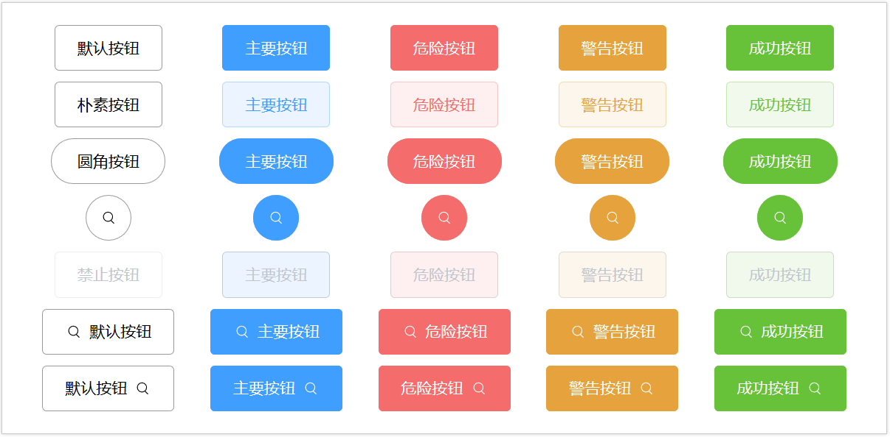

#2020/01/29
##重构项目结构和重构Button组件并追加功能
###1.重构项目结构

###2.重构Button组件并追加功能
1. 追加一个loading组件,loading状态下直接使用默认loading
```vue
  <w-icon v-if="icon&&!loading" :name="icon"></w-icon>
  <!--为追加的默认loading组件-->
  <w-icon v-if="loading" class="loading" name="loading"></w-icon>
```
2. 追加type属性让用户可以控制按钮的颜色之类的样式按钮选择
* primary
* success
* danger
* warning
3. 追加plain属性开关可以控制type属性下的颜色的亮度提高
4. 由于默认icon排布在文字的左方，如果需要添加icon至右方需要在slot中自行添加
```vue
<w-button button-disabled>禁止按钮<w-icon name="setting"></w-icon></w-button>
```
5. 
###3.重构input组件
1. 在template中嵌套template可以减少不必要的标签
```vue
<template>
    <div class="w-input">
        <input class="w-input-inner" type="text" :read-only="readOnly" :disabled="disabled">
        <!--嵌套template-->
        <template v-if="error">
            <w-icon name="information"></w-icon>
            <span class="info">message</span>
        </template>
    </div>
</template>
```
2. 完成Vue的input组件的初步单元测试，学习到手动触发事件,以及使用Event的target使用方法
```ecmascript 6
it('should support input event', function () {
      const wrapper = shallowMount(WInput);
      let callback = sinon.fake();
      wrapper.vm.$on('input',callback);
      let event = new Event('input');
      Object.defineProperty(event,'target',{
        value:{value:'hi'},
        enumerable:true
      });
      const inputElement = wrapper.vm.$el.querySelector('input');
      inputElement.dispatchEvent(event);
      expect(callback.called).to.equals(true);
      expect(callback).to.have.been.calledWith('hi');
    });
```
#2020/01/30
##重构datapicker组件
* 利用事件代理机制将每个日期按钮事件交由父组件统一处理，不过需要利用dataset
* 利用table代替原有的纯div组织每个日期
* 通过指令解决input的blur导致无法选择的问题
##存在的问题点
1. 该datepicker在node.js环境下日期会超前一天
2. 该datepicker的星期顺序必须["日", "一", "二", "三", "四", "五", "六"]
##原因
1. 该datepicker组件采用时间戳进行计算
##技巧
1. 处理二维数组flat后的一维数组
```ecmascript 6
// 一维数组转换二维数组的方法,即可访问到该元素原先属于第几行第几列
let arr = [];
for (let i = 0; i < 6; i++) {
 for (let j = 0; j < 7; j++) {
  console.log(arr[i * 7 + j])
 }
}
```
2. 计算当前面板的核心算法
```ecmascript 6
function dates(date) {
        // 基于时间戳进行计算，在node环境下运行会存在差异
        //42个日期，每行7列
        let year = date.getFullYear();

        let month = date.getMonth();
        // 获取当前月份的第一天
        let firstDateOfCurrentMonth = new Date(year, month, 1);
        //获取当前月份的第一天星期，该数字有：周三数字3可以表示在其前面有3天
        let week = firstDateOfCurrentMonth.getDay();

        let startDateTimestamp = firstDateOfCurrentMonth - week * 24 * 60 * 60 * 1000;

        let dates = [];

        for (let i = 0; i < 42; i++) {
          dates.push(new Date(startDateTimestamp + i * 24 * 60 * 60 * 1000))
        }
        return dates;
      }
```
#2020/01/31
##重构分页器
###1. 修改样式，使用mixin提取公共部分样式
###2. 添加前后更多的功能，使用element-ui的算法

#2020/02/01
##整合toast和scroll-view
* 待完善功能
    - scroll-view添加懒加载
    - scroll-view添加滚动监听回调
    - toast添加多个toast同时打开
    - 。。。。还有很多
#2020/02/03
##构建可以自动播放的无缝轮播