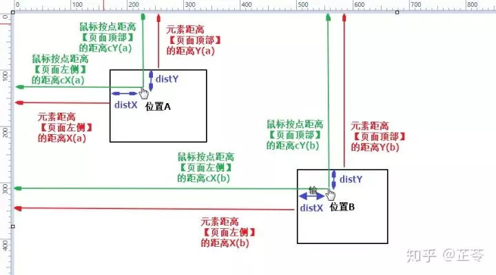

#2020/01/17
##开发Scroll-View组件
###实现原理
原生浏览器出现滚动条必要条件
1. 子容器高度高于父容器
2. 父容器使用overflow:auto
基于监听wheel滚动事件的Scroll-View
1. 子容器高度高于父容器
2. 父容器wrapper使用overflow:hidden;子容器scroll-view用overflow:hidden触发BFC解决边距问题;
3. 父容器监听wheel事件；
	（windows）deltaY正负表示方向 +朝内滚动_页面上移，-朝外滚动_页面下移
	 问题点:虽然监听wheel事件，但是也会导致有滚动条的页面的滚动
4. 滚动条的实现 关系式
```
	滚动条长度与内容长度、可视区域长度、滚动轨道长度的关系
barHeight/trackHeight = visiableHeight / contentHeight
	滚动条滚动距离与内容滚动距离的关系
contentTranslate = -barTranslateY / trackHeight * contentHeight
	
```
###功能列表
1. 
2. 
3. 

#2020/01/18
###完成scroll-view的基本功能
1. 滚轮滚动
2. 鼠标拖动scroll bar实现滚动

拖拽的实现原理(以下均未被优化)

1. 基于left和top
```ecmascript 6
export function bindMoveDragByPos(el) {
  let start = {};
  let end = {};
  let dif = {};
  let isMoving = false;
  el.addEventListener('mousedown', (e) => {
    isMoving = true;
    start = {x: e.pageX, y: e.pageY};
    let difX = e.pageX - el.offsetLeft;
    let difY = e.pageY - el.offsetTop;
    dif = {difX, difY};
  });
  document.addEventListener('mousemove', (e) => {
    if (isMoving) {
      end = {x: e.pageX, y: e.pageY};
      let offsetX = e.pageX - dif.difX;
      let offsetY = e.pageY - dif.difY;
      el.style.left = offsetX + 'px';
      el.style.top = offsetY + 'px';
    }
  });
  document.addEventListener('mouseup', (e) => {
    isMoving = false;
    console.log('translateY', end.y - start.y)
  });
}
```
2. 基于translate
```ecmascript 6
export function bindMoveDragByTrans(el) {
  let start = {};
  let isMoving = false;
  let translate = {x: 0, y: 0, z: 1};
  el.addEventListener('mousedown', (e) => {
    isMoving = true;
    start = {x: e.pageX, y: e.pageY};
    console.log('mousedown');

    el.addEventListener('mousemove', handleMouseMove);
    el.addEventListener('mouseup', handleMouseUp);
  });


  function handleMouseMove(e) {
    console.log('mousemove');
    if (isMoving) {
      let end = {x: e.pageX, y: e.pageY};
      let deltaX = end.x - start.x;
      let deltaY = end.y - start.y;
      start = end;
      translate.x = translate.x + deltaX;
      translate.y = translate.y + deltaY;
      el.style.transform = `translate3d(${translate.x}px,${translate.y}px,${translate.z}px)`;
    }
  }

  function handleMouseUp(e) {
    isMoving = false;
    el.removeEventListener('mousemove', handleMouseMove);
    el.removeEventListener('mouseup', handleMouseUp);
  }
}
```

#2020/01/19
###任务一:代码重构
1. 重构wheel事件监听
2. 将多处用到的变量提升为data中的变量
3. 与多个data中的变量相关的，可用computed
###任务二:如果scroll-view加载网络资源时，所有样式都初始化完成，但是加载完资源后内容扩充，导致scroll-bar比例不一致
-使用MutationObserver监听DOM结构变化